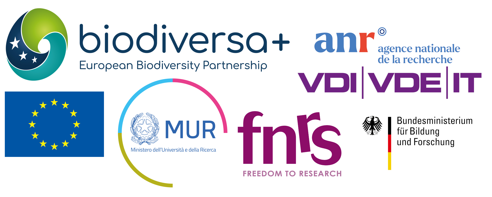

# Framework & Scope

## Funding Acknowledgement

This research was funded by Biodiversa+, the European Biodiversity Partnership, in the context of the MOOBYF project under the 2022-2023 BiodivMon joint call. It was co- funded by the European Commission (GA No. 101052342) and the following funding organisations: ANR - Agence Nationale de la Recherche and Office Français de la Biodiversité – France, FONDS DE LA RECHERCHE SCIENTIFIQUE – FNRS - Belgium, Ministry of Universities and Research, Italy, and Deutsche Forschungsgemeinschaft e.V. ; BMBF-VDI/VDE INNOVATION + TECHNIK GMBH, Germany.

[^1]: DOI: [10.3030/101052342](https://doi.org/10.3030/101052342)

{fig-align="center"}



## Administrative information

[Project]{.smallcaps}

:   MOOBYF: Monitoring the Open-Ocean BiodiversitY with Fishers

[Responsible]{.smallcaps}:

:   Data Management Board (DMB)

Work package

:   WP8 Project Management

[Deliverable]{.smallcaps}

:   DX\. Data Management Plan (DMP)

[Delivery date]{.smallcaps}

:   02 March 2026

[Availability]{.smallcaps}

:   Public

### Data Management Plan version history

+---------------+------------------+------------------+---------------------+
| Version       | Date             | Modification     | Author(s)           |
+===============+==================+==================+=====================+
| 1.0           | 31 march 2023    | Original version | Julien Lebranchu    |
+---------------+------------------+------------------+---------------------+
| 2.0           | 07 november 2024 |                  | DMB                 |
|               |                  |                  |                     |
|               |                  |                  | Led by J. Lebranchu |
+---------------+------------------+------------------+---------------------+
| 2.1           | 02 march 2026    |                  | DMB.                |
+---------------+------------------+------------------+---------------------+

### DMB - Data Management Board {#sec-dmb-listing}

+---------------+------------------+----------------------+---------------+
| Country       | Institute        | DMB member           | Active start  |
+===============+==================+======================+===============+
| France        | IRD              | Manuela Capello      | April 2024    |
+---------------+------------------+----------------------+---------------+
| France        | IRD              | Julien Lebranchu\*   | April 2024    |
+---------------+------------------+----------------------+---------------+
| France        | IRD              | Nawfel Tabie-Geraux  | January 2026  |
+---------------+------------------+----------------------+---------------+
| Indonesia     | BRIN             | Wudianto Wudianto    | April 2024    |
+---------------+------------------+----------------------+---------------+
| Maldives      | MMRI             | Ahmed Riyaz Jauharee | April 2024    |
+---------------+------------------+----------------------+---------------+
| France        | OFB              | Cyrielle Jac         | April 2024    |
+---------------+------------------+----------------------+---------------+
| Germany       | ZMT              | Ma Souza             | April 2024    |
+---------------+------------------+----------------------+---------------+
| Italy         | CNR              | Marco Andrello       | April 2024    |
+---------------+------------------+----------------------+---------------+
| Belgium       | Univ Liège       | Marine Banse         | April 2024    |
+---------------+------------------+----------------------+---------------+
| Italy         | Univ Padova      | Leonardo Congiu      | April 2024    |
+---------------+------------------+----------------------+---------------+
| France        | Univ Montpellier | Bastien Mérigot      | April 2024    |
+---------------+------------------+----------------------+---------------+

\*Committee Chair



## Scope

-   Supports common understanding among Partners and associated teams for the management of data associated.
-   Serves as a tool to ensure the project meets research needs, partner institutions, national and EU standards for data access (inclusive of FAIR principles and the deposit of data into appropriate public repositories).
-   Provides a mutually agreed framework defining the use, sharing, and storage of data.

## Acronyms, abbreviations, & definitions

DMP

:   Data Management Plan

FAIR

:   Findable, Accessible, Interoperable and Reusable

GDPR

:   General Data Protection Regulation

WP

:   Work Package. Numbers as per funded proposal

DMB

:   Data Management Board

# DMB

## Membership, responsibilities, and scope

The DMB will develop, implement, and update an operational MOOBYF Data Management Plan, support implementation of the DMP, and ensure the MOOBYF DMP meets research needs, partner institution, national and EU standards.

-   The DMB is composed of (minimum) one representative from each Partner institution. See @sec-dmb-listing for the list of DMB members.
-   DMB meets 2 times per year (virtually), with interim virtual meetings and digital communications as needed.

# Data collection and Digital outputs

## Purpose of data collection

Data collection and research are in accordance with the objective of the project which is to develop monitoring platforms to observe the open ocean and its biodiversity in collaboration with fishers.

More information are available online :

-   MOOBYF Website : <https://moobyf.com> 
-   Biodiversa+ : <https://www.biodiversa.eu/2024/04/15/moobyf/>
-   MOOBYF Communities on Zenodo : <https://zenodo.org/communities/moobyf-biodiversa/>

## Data collection

### Primary data

Primary data are the raw data collected during the project before any processing or analysis.

#### Bioacoustic data

Data are collected using SNAP recorders, which aredeployed with a pre-programmed recorder to capture 10-minute sequences every hour over the course of a week.
Data are stored in WAV format.

#### Temperature-Depth Recorder data

TDR Data are collected using STARODDI archival tags. A dedicated protocol for tag deployment and data retrieval has been used.
Data is downloaded using the Seastar (Staroddi) Software, Version 9.45.
A dedicated R script is used to read and plot the TD data.
Data are stored in DAT file as numeric.

#### Echosounder data

Echosounder data are collected through two types of buoys : 

1. Marine Instruments M3i+ buoys.
  - A dedicated protocol for buoy deployment and data download has been used. Data download are performed using the MSB Software (Marine Instruments), Version 5.0.
  
  - Data are stored in CSV files as numeric values. They are read and process using a dedicated R script to determine the presence orabsence of tuna.

2. Simrad WBAT echosounder.
  - A dedicated protocol for buoy deployment and data download has been used. Data download are performed using the Matecho and Movies3D software (under Matlab environment), version Matecho20240821V7 and Movies3D2.2.16
  
  - Data are stored in EK80 CW or EK80 FM file formats. Raw data acquired from the WBAT echosounder must be converted in HAC format (DYYYYMMDD-THHMMSS-X.hac), the ICES HAC Standard Data Exchange Format and then into Matlab HDF5 format with Matecho Software. 

#### Surveys data

Data are collected through qualitative methods, including focus group discussions, key informant interviews, and observations. The resulting data include different types of materials such as textual documents (e.g. interview transcripts and observation notes), images, audio and video recordings. [ATLAS.ti](https://atlasti.com/fr) software will be used for coding and analysing the collected data.

#### Video data

Data are collected with 4 IP cameras situated approximately 1.3 m below the surface. 
The camera is programmed to film at different durations/frequencies to assess the best sampling protocol to detect species near the AFAD. 

#### Deep Learning Model data

An annotated dataset of video images has been constructed using an annotation software to label the species of interest in each frame. From this dataset, a deep learning model has been developed and trained using state-of-the-art architectures such as convolutional neural networks (CNNs). 

#### DNA data

During the project, the content stomach and eDNA samples is collected and analysed through metabarcoding methods. The resulting dataset will be a list of species.

### Secondary data

The responsibility for managing secondary and working datasets, as well as storage, belongs to the partners, with guidance provided by the DMB. These datasets are usually generated through analysis pipelines and can be reproduced by applying specific analyses, pipelines, or scripts. The final outputs of these processes are used for reports, publications, and other deliverables.

### Other data

#### Photos

Photos collected within the project will include the photographer's name in the file naming convention to ensure proper attribution. By submitting photos to the project directories, partners acknowledge that their name will be publicly credited if/when the photos are used in presentations, publications, or communications, supporting transparent credit attribution.

For photos featuring people, they can only be submitted if explicit permission is obtained from those depicted. The initials of the individuals must be included in the file name, and their full names should be documented in the file MOOBYF_photos_README. The photographer is responsible for ensuring that everyone featured in a photo understands that their image and, optionally, their name *will* be publicly visible if/when the photo is used for presentations, publications, or communications.

## Expected data sizes

The amount of data generated depends in large part on which sequencing technologies are available at the time of sample submission.

MOOBYF is prepared for the secure storage of 1 Tb of data, which can be extended.

+-----------------------------------+--------------------------+
| Description                       | Expected data sizes (Gb) |
+===================================+==========================+
| DNA sequence                      | To be estimated          |
+-----------------------------------+--------------------------+
| Video files from embarked cameras | 400                      |
+-----------------------------------+--------------------------+
| Deep Learning models              | 200                      |
+-----------------------------------+--------------------------+
| TDR datasets                      | 1                        |
+-----------------------------------+--------------------------+
| echosounder datasets              | 200                      |
+-----------------------------------+--------------------------+
| bioacoustics dataset              | 150                      |
+-----------------------------------+--------------------------+
| local knowledge                   | 1                        |
+-----------------------------------+--------------------------+

## Expected datasets & outputs of long-term value

+-----------------------------------+---------------------+---------------------------+
| Description                       | WP                  | Public availability       |
+===================================+=====================+===========================+
| Scientific papers                 | 1, 2, 3, 4, 5, 6, 7 | Published open access[^2] |
+-----------------------------------+---------------------+---------------------------+
| Scripts and workflows             | 2, 3, 4, 5, 6       | Zenodo, GitHub            |
+-----------------------------------+---------------------+---------------------------+
| DNA sequence                      | 4                   | To be defined              |
+-----------------------------------+---------------------+---------------------------+
| Video files from embarked cameras | 5                   | Zenodo                    |
+-----------------------------------+---------------------+---------------------------+
| Deep Learning models              | 3, 5                | Github, Zenodo            |
+-----------------------------------+---------------------+---------------------------+
| echosounder datasets              | 3                   | Zenodo                    |
+-----------------------------------+---------------------+---------------------------+
| bioacoustics dataset              | 2                   | Zenodo                    |
+-----------------------------------+---------------------+---------------------------+
| local knowledge                   | 1, 6                | Zenodo                    |
+-----------------------------------+---------------------+---------------------------+
| sampling protocols                | 2, 3, 4, 5, 6       | Zenodo                    |
+-----------------------------------+---------------------+---------------------------+
| Personal information              | 1, 6                | Not public, not shared    |
+-----------------------------------+---------------------+---------------------------+

[^2]: Open archive like [HAL](https://ird.hal.science)

# Data identifiers {#sec-data-identifier}

## Unique Site Identifiers

Each site and sample will be assigned a **Unique Site Identifier (USID)**. The USID is a combination of codes representing:

- **Methodology (MT)**
- **Country (CC)**
- **Targeted Site (TS)**
- **Fish Aggregating Device (FAD)**

The identifier format is: 
MT_CC_TS_FAD

**Example:** `BA_IDN_GO_FAD2`, corresponding to a bioacoustic deployment conducted at the second FAD located in Gondol, Indonesia.

| Methodology     | Code |
|-----------------|------|
| bioacoustics    | BA   |
| echosounder buoy| MI   |
| wbat            | WB   |
| video           | VD   |
| metabarcoding   | MB   |

: Methodology Codes (MT)

| Country   | Code               |
|-----------|--------------------|
| Indonesia | IDN                |
| Seychelles| SYC                |
| Maldives  | MDV                |
| Kiribati  | KIR                |

: Country Codes (ISO 3166-1 Alpha-3) (CC)

| Targeted site  | Site code |
|----------------|-----------|
| Gondol         | GO        |
| Pancer         | PA        |
| Mahe           | MA        |
| Captive fish   | CF        |

: Targeted Site Codes (TS)

| FAD Identifier | Description                   |
|----------------|-------------------------------|
| FAD1           | First FAD deployed at site    |
| FAD2           | Second FAD deployed at site   |
| FAD3           | Third FAD deployed at site    |
| FAD...         | ... FAD deployed at site      |

: Fish Aggregating Device Identifiers (FAD)

## Sampling naming conventions

### Primary data

Primary data files will be named based on the **Unique Site Identifier (USID)** defined above, combined with acquisition information. The general file naming structure will be : 

`MT_CC_TS_FAD_YYYY_MM_DD_SX`

where YYYY_MM_DD is the date of acquisition and SX is the sample number (e.g. a recording depth for a hydrophone deployment or a camera identifier).

**Example (video data):**  
`VD_IDN_PA_FAD2_2025_04_01_S1`

For each methodology, a dedicated metadata table will be maintained. Each table will contain one record per sample and include, at minimum, the following fields:

-   Folder name
-   File name
-   Latitude
-   Longitude
-   Start date
-   End date
-   Distance to FAD

### Secondary data

Secondary data products will be generated from primary datasets while preserving an explicit and unambiguous link to their source. File naming will strictly follow the USID-based convention of the originating primary data, with the addition of a standardized suffix identifying the derived data type.

**Example (video-derived data):**  
`VD_IDN_PA_FAD2_2025_04_01_S1_FRM0001`  
(first image frame extracted from a video sample)

The table below defines the correspondence between primary data, derived data products, and the associated codes used in file naming. 

| Primary data          | Derived data description                          | Code     |
|-----------------------|---------------------------------------------------|----------|
| Video (VD)            | Extracted image frames                            | FRM####  |

This structured approach guarantees full traceability between primary and secondary datasets, enables robust cross-referencing with metadata tables.

# Data security, Storage & Costs

## During the project

-   Non-personal data backup : All MOOBYF data will be stored on a secure data storage (MARBEC_NAS) to prevent data loss and data security.
-   Personal data: Stakeholder personal data should be collected and stored using the backup system of their institute.
-   IRD Drive : MOOBYF has a shared directory on IRD Drive with a proficient backup system. Use of this product is controlled directly by the IT staff at IRD and they managed the access with at a user level.

## Long-term

Deposits of data in recognised public data repositories are a priority. Data and other digital outputs will be made available following FAIR standards.

## Costs

-   Costs for the safe storage of primary data are assumed by the coordinator at IRD, other costs are assumed by the Partners. Costs are covered by IRD until all data has been submitted to online repositories.
-   Partners assume responsibility for their local costs of data backup, security and storage of primary data copies, secondary data and scripts.

## Data Organisation

### Primary data

Directory structure and naming conventions will be established and updated by the DMB prioritising FAIR principles. 
Directory and file names are expected to use the PrID when applicable (see @sec-data-identifier). 

### Secondary data

These data are generated at Partner institutions and must adhere to institutional requirements for Directory structure and naming conventions where applicable. To share these data among Partners (directly, via Zenodo Community or other) or with other approved recipients, the conventions for primary data must be applied.

# Data use & sharing

## General principles

Datasets will be formatted and made accessible at the time of publication or before according to the community standards and will follow FAIR principles.

## Within project data & digital output sharing

### Primary data

All data and metadata will be produced by individual Partner institutions and shared on a common platform or promptly transferred as digital copies to the IRD for backup. Additionally, copies of raw data may be made available as specified in Section 6.1 during the project period.

The project coordinator and the DMB representatives at IRD will have access to these datasets and will provide data to Partners upon request, with one exception:

If a data request extends beyond the defined responsibilities of a Partner’s project role (as outlined in the MOOBYF application), the DMB will review the request before granting access. Access will be approved if all the following conditions are met:

1. The data request aligns with and supports MOOBYF’s goals and objectives.
2. Accessing the data does not interfere with the rights and responsibilities of other Partners within the project.
3. Formal, mutually agreed arrangements—such as co-authorship, collaboration, or other fair agreements—are confirmed via email to the DMB.

### Secondary data

Data generated by partner institutions should be made accessible to all partners following the same principles and criteria established for Primary Data (as described above).

Data sharing can be conducted through any secure method unless specified otherwise by the DMB or in future updates to the DMP.

## Public access to data and digital outputs

###  Scientific papers

We prioritize publishing open access. Papers will be made publicly available from the time of publication. 
By mutual agreement among authors, the pre-publication version may be made publicly available via a field-appropriate and recognized pre-print archive.

### Data that is the basis of Scientific papers: 
  
To support publication, datasets relied on for scientific papers will be deposited in public repositories 
and made publicly available upon formal publication (does not include pre-review or
pre-print versions).

The lead author and corresponding author of each manuscript is responsible for
coordinating with the DMB and other work groups and authors to ensure that the data
access is made public upon publication.

# Document credits & How to cite

#### How to cite:

Lebranchu J., Tabie-Geraux N., Soria M., Ferse S., Parmentier E., Banse M., Suza M., Breckwoldt A., Andrello M., & Capello M. (2026). MOOBYF Data Management Plan (Version 2.1). Zenodo. [10.5281/zenodo.18741130](https://doi.org/10.5281/zenodo.18741130)

#### Photo credits:

Cover : Manuela Capello, MOOBYF project, Bali, Indonesia, 2024.

<!-- #### Font: -->

<!-- # References -->